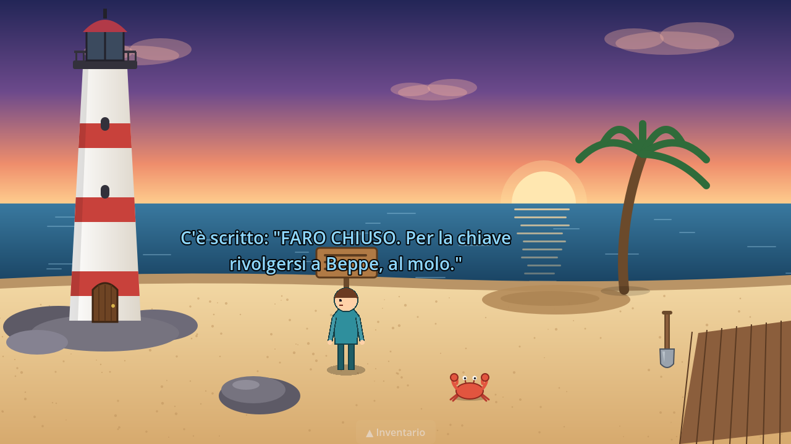
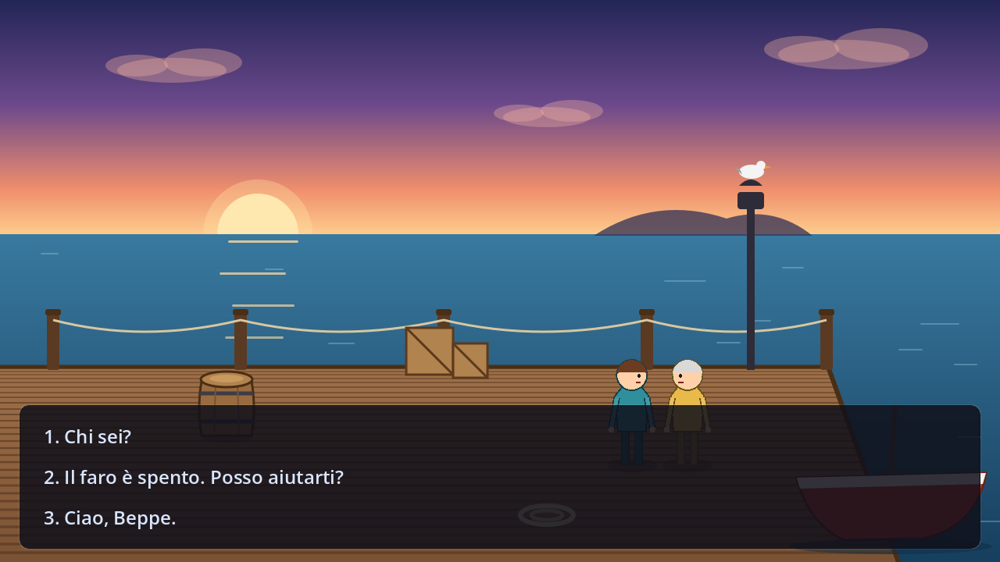
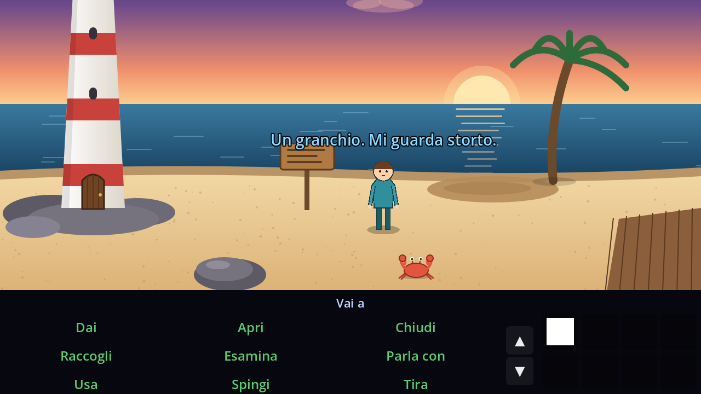
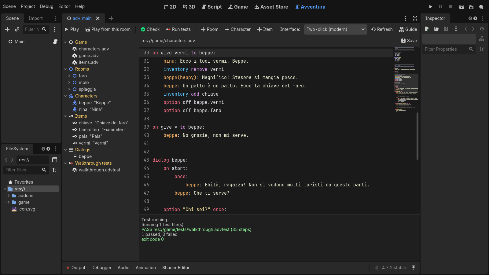

# Avventura

**Motore per avventure grafiche punta-e-clicca in stile SCUMM / AGS, per Godot 4.**
Facile per chi scrive storie, potente per chi programma, e pensato per lavorare insieme a
**Claude Code**, che può scrivere il gioco, controllarlo, giocarlo e guardarlo.



Il repository contiene il motore (`addons/avventura/`) e un piccolo gioco completo in
italiano, **Il Segreto del Faro** (`game/`), da giocare e da usare come esempio.

## Caratteristiche

- **AdvScript**, un linguaggio da sceneggiatura: battute (`nina: Ciao!`), camminate,
  inventario, stati degli oggetti, variabili, condizioni, cutscene saltabili, script in
  sottofondo, battute a caso/a turno/una sola volta, funzioni. Si legge come un copione.
- **Dialoghi ad albero** alla Monkey Island: opzioni una tantum, nascoste, condizionali,
  sotto-dialoghi.
- **Stanze come scene Godot**: sfondo, aree calpestabili con ostacoli e percorso più breve,
  prospettiva, hotspot con forme poligonali, punti d'ingresso, telecamera che segue.
- **Zero codice per le cose semplici**: descrizione, oggetto da raccogliere e uscita si
  impostano dall'ispettore.
- **Si prototipa senza grafica**: i personaggi senza sprite sono manichini animati disegnati
  dal motore, le stanze senza sfondo hanno un colore, gli oggetti senza icona un segnaposto.
- **Due interfacce pronte**: moderna a due clic (predefinita) e classica a nove verbi SCUMM;
  menu, salvataggi (JSON leggibile), impostazioni, suggerimenti con Tab, console di debug.
- **Scheda "Avventura" nell'editor**: albero del gioco, editor degli script con colori,
  completamento dei nomi e segnalazione degli errori, procedure guidate per stanze,
  personaggi e oggetti, pulsanti *Controlla*, *Esegui test*, *Gioca da questa stanza*.
- **Test automatici**: la soluzione del gioco è un file `.advtest` rigiocato a ogni modifica;
  il *lint* trova riferimenti sbagliati con file e riga (e suggerisce "intendevi...?").
- **Elastico**: GDScript per tutto il resto (funzioni della stanza richiamabili dagli script,
  API completa `Adv.*`, segnali), interfacce personalizzabili o sostituibili, traduzioni.

| Dialoghi | Interfaccia SCUMM | Scheda nell'editor |
|---|---|---|
|  |  |  |

## Come iniziare

1. Installa [Godot 4.4 o successivo](https://godotengine.org/download) (provato con 4.4.1 e 4.7.2).
2. Apri questa cartella con Godot (*Importa* → `project.godot`).
3. Premi **F5** per giocare, oppure apri la scheda **Avventura** in alto.
4. Leggi la **[Guida](docs/GUIDA.md)**: dal primo hotspot all'esportazione.

Per usare il motore in un altro progetto copia `addons/avventura/`, attiva il plugin in
*Progetto → Impostazioni progetto → Plugin* e crea la cartella `game/` (o usa
*+ Stanza* dalla scheda Avventura). La scena principale deve essere
`res://addons/avventura/core/adv_main.tscn` (o una tua scena che chiami `Adv.boot(self)`).

Un assaggio di AdvScript:

```
on use chiave on porta:
    nina: Proviamo...
    state porta aperta
    set faro_aperto = true
    inventory remove chiave
    nina: Si è aperta!

dialog beppe:
    option faro "Il faro è spento. Posso aiutarti?":
        beppe: Portami dei vermi e ne riparliamo.
        option on beppe.vermi
    option vermi "Dove trovo dei vermi?" hidden once:
        beppe: Sotto la sabbia bagnata.
    option "Ciao, Beppe.":
        end
```

## Claude Code

Il progetto include tutto il necessario perché Claude Code lavori sul gioco in autonomia:

- `CLAUDE.md` con struttura, convenzioni e riferimento rapido del linguaggio;
- un **server MCP** senza dipendenze (`tools/adv_mcp.py`, già registrato in `.mcp.json`) con
  gli strumenti `adventure_lint`, `adventure_test`, `adventure_play` (partita testuale che
  ricorda lo stato), `adventure_screenshot` (Claude *vede* il gioco), `adventure_live`
  (comanda la finestra in cui stai giocando) e `adventure_create`;
- le skill `playtest`, `new-room` e `new-puzzle` in `.claude/skills/`;
- una CLI per il terminale:

```sh
python3 tools/adv.py lint                          # controlli statici
python3 tools/adv.py test                          # soluzioni automatiche
python3 tools/adv.py play "look cartello; pick pala" --new
python3 tools/adv.py shot schermata.png            # screenshot della partita
python3 tools/adv.py run                           # gioca tu, Claude può guardare e aiutare
```

Esempio di partita giocata da Claude:

```
> talk to beppe
beppe: Ehilà, ragazza! Non si vedono molti turisti da queste parti.
beppe: Che ti serve?
[choose] 1) Chi sei?  2) Il faro è spento. Posso aiutarti?  3) Ciao, Beppe.
> choose 2
nina: Il faro è spento. Posso aiutarti?
beppe: La chiave del faro ce l'ho io... ma non te la do gratis.
```

Serve Python 3.8+; se `godot` non è nel PATH imposta la variabile d'ambiente `GODOT`
(anche nella sezione `env` di `.mcp.json`).

## Struttura

```
addons/avventura/
  core/      autoload Adv, parser e interprete di AdvScript, stato, linter, controller testuale
  nodes/     AdvRoom, AdvHotspot, AdvCharacter, AdvWalkArea, AdvEntry
  gui/       interfaccia a due clic, interfaccia SCUMM, componenti comuni
  editor/    scheda "Avventura", evidenziazione della sintassi, esportazione
  i18n/      testi dell'interfaccia (inglese, italiano)
game/        il gioco dimostrativo
tests/       test unitari e fixture di regressione del motore
tools/       CLI e server MCP
docs/        guida e immagini
```

## Sviluppo del motore

```sh
godot --headless --path . --import                                  # prima volta
godot --headless --path . --script res://tests/unit/run_unit_tests.gd
godot --headless --path . -- --adv-game-dir=res://tests/fixture --adv-test
python3 tools/adv.py lint && python3 tools/adv.py test
```

La CI di GitHub (`.github/workflows/ci.yml`) esegue tutto questo con Godot 4.4 e 4.7.
